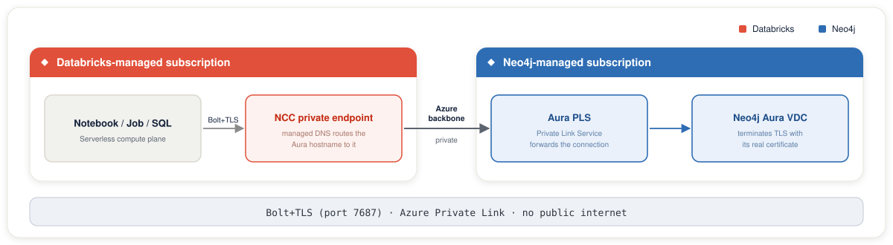

# Azure Databricks Serverless + Neo4j Aura PrivateLink

Production-grade reference for establishing private, end-to-end connectivity between **Azure Databricks Serverless** and **Neo4j Aura (Azure)** using **Azure Private Link** and Databricks **Network Connectivity Configurations (NCC)**.

This repository provides a validated step-by-step setup, along with notebooks, Terraform, and helper scripts.

The Terraform for this setup is the **NCC stack**, [`infra/terraform/databricks-ncc/`](infra/terraform/databricks-ncc/): Databricks NCC + private endpoint rule + workspace binding.

For classic Databricks, AKS, ADF, or jump VMs, see [Private Endpoint stack setup](docs/private-endpoint-stack-setup.md).

End-to-end validation runs via [`notebooks/01_validate_connectivity.py`](notebooks/01_validate_connectivity.py), the deployment-agnostic check that `scripts/automate.py` runs by default. [`notebooks/04_smoke_test.py`](notebooks/04_smoke_test.py) adds a 100-row write and read-back test over the private path. See [`screenshots/`](screenshots/) for the NCC stack setup screens.

---

## Problem Statement

Enterprise teams need to exchange data between Delta tables in Azure Databricks and Neo4j Aura graph databases without traversing the public internet. Public TLS endpoints with IP allowlists are operationally fragile (egress IPs change, allowlists drift) and not aligned with Zero Trust principles for regulated workloads.

This repository documents a private-only architecture that:

- Routes all Bolt traffic between Databricks Serverless and Neo4j Aura over the Azure backbone
- Eliminates customer-managed VNets on the consumer side via Databricks NCC
- Supports disabling public ingress on Aura entirely after validation

---

## Architecture



See [docs/architecture.md](docs/architecture.md) for a detailed walkthrough including the data-plane vs control-plane distinction and DNS routing behavior.

---

## Prerequisites

### Aura side

| Item | Value |
|------|-------|
| Aura tier | **AuraDB Virtual Dedicated Cloud (VDC)** or **AuraDS Enterprise** |
| Cloud | Azure |
| Console role | Org admin on the Aura tenant |

> Private Link is **not available** on Aura Professional or Business Critical on Azure. Verify your tier before starting.

### Databricks side

| Item | Value |
|------|-------|
| Workspace plan | **Premium** |
| Account plan | **Premium** |
| Role | **Azure Databricks account admin** (workspace admin is not sufficient) |
| Region | Must match the NCC region |

### Azure side

| Item | Value |
|------|-------|
| Azure login | Signed in with `az login` as a Databricks account admin. Terraform authenticates to the Databricks account through the Azure CLI. For CI/CD, set a service principal with account admin in `terraform.tfvars` instead. |
| Region | Region that supports Private Link for your target resources |

---

## NCC stack

Serverless compute lives in Databricks-managed subscriptions, so the only supported private-network path is an NCC plus a private endpoint rule. Databricks creates and manages the private endpoint and its DNS.

Once you are ready to start, see [Setup: automated or manual](#setup-automated-or-manual) to choose how to run it.

## Setup: automated or manual

The Aura console has no API, so its steps stay manual either way:

- **Before you start:** Provision Aura and enable Private Link to get the PLS alias and hostname (Steps 1 and 2).
- **During setup:** Two actions pause the flow. You add the Databricks-managed subscription to Aura's allow-list (Step 6) and approve the private endpoint (Step 7).
- **After validation:** Disabling public access (Step 9) is also manual.

Everything else on the Databricks side can be scripted.

**Automated (recommended for the NCC stack demo).** `scripts/automate.py` drives the Databricks side end to end: it runs Terraform, polls the endpoint rule to ESTABLISHED, restarts warehouses, loads the `neo4j` secret scope, and runs the validation notebook. It is re-entrant and pauses only for the two Aura actions above.

```bash
uv run scripts/automate.py run --account-profile <name>
```

See [docs/automate-tf-ncc-setup.md](docs/automate-tf-ncc-setup.md) for the full flow. To remove the Databricks side afterward, see [Teardown](#teardown).

**Manual / step-by-step.** Follow Steps 0-9 below. Use this to understand each step.

For a CLI-first version of the Databricks steps, see [docs/manual-ncc-setup.md](docs/manual-ncc-setup.md). It documents what the Terraform stack does, plus steps the README does not cover:

- Creating the NCC and attaching it to the workspace with the Databricks CLI or REST, instead of the console (Steps 4 and 5).
- Creating the private endpoint rule with the CLI, including several hostnames in `domain_names`.
- Checking the rule status until it reads `ESTABLISHED`.
- Adding a `p-*.neo4j.io` routing hostname to an existing rule, without Terraform.
- Deleting and recreating an expired or failed rule.

## Setup Steps (Validated)

### Step 0: Sign in and collect your values

This step gathers the values that later steps reuse.

| Value | What it is | Where to find it |
|-------|------------|------------------|
| `TENANT_ID` | Entra ID tenant that owns the subscription your workspace is deployed in | Azure portal, Microsoft Entra ID, Overview. Or run `az account show --query tenantId -o tsv`. |
| `SUB_ID` | Azure subscription that holds the workspace | Azure portal, Subscriptions |
| `WORKSPACE_PROFILE` | Databricks CLI profile name for the workspace | `~/.databrickscfg`, or run `databricks auth profiles` |
| `WORKSPACE_URL` | Host URL of the workspace | Azure portal, the workspace Overview page |
| `WORKSPACE_NAME` | Display name of the workspace in the account | Account Console, Workspaces |
| `ACCOUNT_PROFILE` | Databricks CLI profile name for the account console | A new name, or an existing account-level profile |
| `DATABRICKS_ACCOUNT_ID` | ID of your Databricks account | Account Console, user menu in the top right corner |
| `NCC_ID` | ID of the NCC attached to the workspace | Looked up by the command at the end of this step |

**Tools.** `az` and the `databricks` CLI must be on PATH. The automated path also needs `uv` and `terraform`.

**Azure login.** Sign in as a Databricks account admin against the correct tenant and subscription:

```bash
az login --tenant <TENANT_ID>
az account set --subscription <SUB_ID>
```

- **Tenant ID:** In the Azure portal, open Microsoft Entra ID and read Tenant ID under Basic information on the Overview page. From the CLI, run `az account show --query tenantId -o tsv`. Use the tenant that owns the subscription your Databricks workspace is deployed in.
- **Subscription ID:** This is a separate value, listed under Subscriptions in the portal.

**Workspace CLI profile.** The profile must exist and authenticate. Set its name once, along with the workspace URL:

```bash
export WORKSPACE_PROFILE="<workspace-profile>"
export WORKSPACE_URL="<workspace-url>"
```

Then check that it authenticates:

```bash
databricks --profile "$WORKSPACE_PROFILE" current-user me
```

If it reports stored credentials from an older CLI version, sign in again:

```bash
databricks auth login --host "$WORKSPACE_URL" --profile "$WORKSPACE_PROFILE"
```

**Account-console CLI profile.** NCC calls target `accounts.azuredatabricks.net`, which is a different auth context from the workspace. Find `DATABRICKS_ACCOUNT_ID` in the Account Console by opening the user menu in the top right corner. Set both values once. Every later command in this README reuses them:

```bash
export ACCOUNT_PROFILE="<account-profile>"
export DATABRICKS_ACCOUNT_ID="<databricks-account-id>"
```

`ACCOUNT_PROFILE` must be a new profile name or an existing account-level profile, never a workspace profile, or the login fails with a host conflict.

Sign in once to create the profile:

```bash
databricks auth login --host https://accounts.azuredatabricks.net \
  --account-id "$DATABRICKS_ACCOUNT_ID" --profile "$ACCOUNT_PROFILE"
```

Then verify the profile can list NCCs:

```bash
databricks --profile "$ACCOUNT_PROFILE" account network-connectivity list-network-connectivity-configurations
```

Any JSON list counts as a pass. Check that each entry shows the `account_id` from the login command above. An auth or permission error means the profile cannot reach the account console. The NCCs listed are existing ones in the account, including expired rules and rules that belong to other people. Leave them alone, because the NCC stack creates its own NCC.

**Collect the values.** Step 6 reads `NCC_ID`. The workspace record holds the ID of the NCC attached to it. Set your workspace name, then run the lookup:

```bash
export WORKSPACE_NAME="<workspace-name>"
```

```bash
export NCC_ID="$(databricks --profile "$ACCOUNT_PROFILE" account workspaces list -o json \
  | jq -r --arg ws "$WORKSPACE_NAME" '.[] | select(.workspace_name==$ws) | .network_connectivity_config_id')"
echo "$NCC_ID"
```

`NCC_ID` is empty until an NCC is attached to the workspace in [Step 5](#step-5-attach-the-ncc-to-your-workspace). The bearer token for Step 6 comes from the same `az login`.

### Step 1: Provision Neo4j Aura VDC on Azure

1. In the [Aura console](https://console.neo4j.io), provision an **AuraDB Virtual Dedicated Cloud** instance in your target Azure region.
2. Wait for the instance to reach **Running** state.
3. Note the **Connection URI** (public form: `neo4j+s://<dbid>.databases.neo4j.io`). This will be replaced by a **Private URI** after Step 2.

### Step 2: Enable Private Link in Aura (Network Access Configuration)

In the Aura console:

1. In the left sidebar, navigate to **Project settings → Security & Networking → Private endpoints**
2. Click **New network access configuration**
3. Configure:
   - **Product**: AuraDB VDC (matches your tier)
   - **Region**: same Azure region as your Aura instance
   - **Target Azure Subscription IDs**: This field is mandatory. Enter your own Azure subscription ID for now. The private endpoint request comes from a **Databricks-managed Azure subscription**, which you only learn after the first apply fails. You add it in [Step 6](#step-6-add-a-private-endpoint-rule-for-neo4j-aura-pls).
   - In **Edit network access configuration**, toggle **Enable Private Link**
4. Click **Save**
5. Copy the **Private Link service name** (also called the PLS alias). It looks like `pls-<id>.<guid>.<region>.azure.privatelinkservice`.
6. Open your Aura instance details. You will now see a **Private URI** in addition to the Connection URI. The Private URI is what your applications will use.

> Private Link in Aura is **region-scoped, not instance-scoped**. Enabling it applies to all instances in the selected region under your tenant.

### Step 3: Create a Databricks Workspace (or use existing)

If you don't already have one:

1. Deploy an **Azure Databricks Workspace** on the **Premium** plan in your chosen region.
2. Confirm **Serverless compute** is enabled (`Settings → Compute → Serverless`).

### Step 4: Create a Network Connectivity Configuration (NCC)

> **Using Terraform for Step 6? Skip Steps 4 and 5.** The NCC stack creates the NCC and binds it to the workspace itself. Creating one in the console as well leaves you with two NCCs, and the Terraform binding replaces yours. Do Steps 4 and 5 by hand only when you create the rule with the REST API.

In the **Account Console** (`https://accounts.azuredatabricks.net/`), as **account admin**:

1. Sidebar → **Security** → **Network connectivity configurations**
2. Click **Add network configuration**
3. Provide:
   - **Name**: e.g., `ncc-eastus-prod`
   - **Region**: must match the workspace region exactly
4. Click **Add**

**Limits to know:**

- Maximum **10 NCCs per region per account**
- Maximum **100 private endpoints per region** (distributed across your NCCs)
- An NCC can attach to up to **50 workspaces**

### Step 5: Attach the NCC to your Workspace

1. Account Console → **Workspaces** → select your workspace
2. Click **Update workspace**
3. In **Network connectivity configurations**, select your NCC
4. Click **Update**
5. **Wait 10 minutes** for propagation
6. **Restart any running serverless services** in the workspace

### Step 6: Add a Private Endpoint Rule for Neo4j Aura PLS

> **Important: you must use REST API, not the account console UI.**
>
> The account console UI requires an Azure-native resource ID + subresource ID. Neo4j Aura is a **third-party/customer-managed Private Link Service**, so the UI flow does not apply. Use Terraform in `infra/terraform/databricks-ncc/` or the Network Connectivity Configurations REST API with the Aura PLS alias as `resource_id` and the Aura hostname in `domain_names`.

See [scripts/create-private-endpoint-rule.sh](scripts/create-private-endpoint-rule.sh) for a ready-to-run script.

Minimal example. `DATABRICKS_ACCOUNT_ID` and `NCC_ID` are already set from [Step 0](#step-0-sign-in-and-collect-your-values). Export the remaining variables the request needs:

```bash
export AURA_PLS_ALIAS="pls-<id>.<guid>.<region>.azure.privatelinkservice"
export AURA_PRIVATE_HOSTNAME="<aura-id>.databases.neo4j.io"
export DATABRICKS_TOKEN="$(az account get-access-token \
  --resource 2ff814a6-3304-4ab8-85cb-cd0e6f879c1d \
  --query accessToken -o tsv)"
```

Then send the request:

```bash
curl --location --request POST \
  "https://accounts.azuredatabricks.net/api/2.0/accounts/${DATABRICKS_ACCOUNT_ID}/network-connectivity-configs/${NCC_ID}/private-endpoint-rules" \
  --header "Authorization: Bearer ${DATABRICKS_TOKEN}" \
  --header "Content-Type: application/json" \
  --data @- <<EOF
{
  "resource_id":  "${AURA_PLS_ALIAS}",
  "domain_names": ["${AURA_PRIVATE_HOSTNAME}"]
}
EOF
```

Where:

- `AURA_PLS_ALIAS` = the Private Link service name returned by the Aura console in Step 2
- `AURA_PRIVATE_HOSTNAME` = the Private URI hostname from Aura (e.g., `<aura-id>.databases.neo4j.io`)

For Aura VDC routing, the Neo4j driver can also receive `p-*.neo4j.io` Bolt addresses from the routing table. If a validation notebook fails with `Cannot resolve address p-...neo4j.io:7687`, add that hostname to the same private endpoint rule `domain_names` list. The Terraform stack exposes this as `aura_extra_domain_names`.

**If the first apply fails** with `ThirdPartyPrivateLinkService...DoesNotExistOrIsNotVisible`, the request came from a Databricks-managed subscription that Aura does not yet trust. Copy the subscription ID from that error into the Aura allow-list, then retry:

1. In the Aura console, open **Project settings → Security & Networking → Private endpoints** and edit the network access configuration from [Step 2](#step-2-enable-private-link-in-aura-network-access-configuration).
2. Add the subscription ID from the error to **Target Azure Subscription IDs**.
3. Save, then re-run the apply.

After submission the rule will appear in the NCC with status `PENDING`.

### Step 7: Approve the Private Endpoint in the Aura Console

1. Return to Aura → **Project settings → Security & Networking → Private endpoints**
2. Open **Edit network access configuration** and go to **Step 3 of 4: Endpoint Connection Requests**
3. Locate the incoming endpoint request from the Databricks-managed Azure subscription
4. Click **Accept**
5. Wait until status reads **Approved**
6. In the [Account Console](https://accounts.azuredatabricks.net/), go to **Security → Network connectivity configurations**, open your NCC, and select the **Private endpoint rules** tab. Refresh the page. The **Connection status** column for your rule should transition from `PENDING` to `ESTABLISHED`

> A rule that stays in `PENDING`, `REJECTED`, or `DISCONNECTED` for **14 days will expire** and must be recreated. Don't leave half-finished setups.

### Step 8: Verify DNS and Connectivity

**Create the secret scope.** The notebooks read Neo4j credentials from a secret scope named `neo4j` in the workspace. Copy the sample file and fill it in. The URI host must match the Private URI host you gave the rule in Step 6:

```bash
cp env.sample .env
```

`.env` is gitignored. It holds `WORKSPACE_PROFILE` and the `NEO4J_*` values. Then run the script from the repository root. It creates the scope and stores the `uri`, `username`, `password`, and `database` keys:

```bash
./scripts/create-secret-scope.sh
```

**Upload the notebooks.** Run this from the repository root. It copies the notebooks into a `neo4j-privatelink` folder in your user area of the workspace:

```bash
: "${WORKSPACE_PROFILE:?WORKSPACE_PROFILE is not set}"
export NOTEBOOK_DIR="/Users/$(databricks --profile "$WORKSPACE_PROFILE" current-user me -o json | jq -r .userName)/neo4j-privatelink"
databricks --profile "$WORKSPACE_PROFILE" workspace mkdirs "$NOTEBOOK_DIR"
for f in notebooks/0*.py; do
  databricks --profile "$WORKSPACE_PROFILE" workspace import "$NOTEBOOK_DIR/$(basename "$f" .py)" \
    --file "$f" --format SOURCE --language PYTHON --overwrite
done
```

Open the `neo4j-privatelink` folder in the workspace and attach each notebook to serverless compute before you run it.

**Run the validation notebook.** Run [notebooks/01_validate_connectivity.py](notebooks/01_validate_connectivity.py) from the uploaded folder. DNS resolution for the Aura Private URI is handled by Databricks NCC because you supplied `domain_names` in Step 6, and the notebook checks it for you. It resolves the Aura host, asserts the address is private, and then runs the Bolt connectivity check. No separate DNS check is needed. For a fuller test that writes and reads back sample data, use [notebooks/04_smoke_test.py](notebooks/04_smoke_test.py), which repeats the same DNS assertion.

**Debugging DNS (optional).** Only if a notebook fails and you need to see which hostname is not resolving privately, run this from a serverless notebook:

```python
import socket
for host in [
    "<aura-id>.databases.neo4j.io",                # replace <aura-id> with your Aura instance id
    "p-<aura-id>-<suffix>.<orch>.neo4j.io",        # routing hostname, if the Bolt check reports one
]:
    print(host, socket.gethostbyname(host))        # should return a 10.x or similar private IP
```

Notebook 01 maps `p-*.neo4j.io` routing hostnames to the private Aura host, so it does not report an unresolved one as a DNS failure. Use this snippet to check them directly.

### Step 9: Disable Public Access on Aura (Recommended)

Once validation succeeds:

1. Aura → **Project settings → Security & Networking → Private endpoints**
2. Toggle **Disable public access**
3. Wait for status to update. Propagation is not instant; monitor the console
4. Re-run the validation notebook to confirm private-only access still works

---

## What's next: access after public traffic is disabled

Once public access is off, two categories of access break that the initial setup
does not cover. Both have dedicated guides:

| Scenario | Guide |
|----------|-------|
| **Developer on a laptop** needs Neo4j Desktop or a browser to reach the private instance | [`docs/developer-desktop-access.md`](docs/developer-desktop-access.md): Azure Bastion (Option A) or Azure P2S VPN with OpenVPN (Option B, recommended for regulated industries) |
| **Batch jobs, pipelines, or services** running in a different VNet or subscription fail to reach Aura | [`docs/batch-jobs-other-vnets.md`](docs/batch-jobs-other-vnets.md): Private DNS Zone VNet links and VNet peering (same subscription) or a new Private Endpoint (cross-subscription) |

---

## Teardown

To remove the Databricks side, follow [docs/teardown.md](docs/teardown.md). It covers `terraform destroy`, the NCC detach step that Terraform cannot do, and the Aura-console cleanup.

---

## Repository Layout

```
.
├── README.md                                       # This file
├── security-review.md                              # Security review findings
├── LICENSE                                         # Apache 2.0
├── docs/
│   ├── architecture.md                             # Detailed architecture and rationale
│   ├── validation-report.md                        # Setup steps checked against official docs
│   ├── troubleshooting.md                          # Common issues and fixes
│   ├── automate-tf-ncc-setup.md                    # Operator steps for scripts/automate.py
│   ├── manual-ncc-setup.md                         # NCC setup by hand with the Databricks CLI or REST
│   ├── teardown.md                                 # Remove the Databricks side and Aura cleanup
│   ├── developer-desktop-access.md                 # Neo4j Desktop / browser access after public traffic disabled
│   ├── batch-jobs-other-vnets.md                   # Private Link connectivity for workloads in other VNets
│   ├── private-endpoint-stack-setup.md             # Private Endpoint stack setup (classic Databricks, AKS, ADF, jump VMs)
│   ├── suggest-improvements.md                     # Suggested improvements
│   └── images/                                     # SVG diagrams used in the docs
├── notebooks/
│   ├── 01_validate_connectivity.py                 # Generic DNS + Bolt sanity check
│   ├── 02_delta_to_neo4j.py                        # Round-trip: Delta -> Neo4j -> Delta
│   ├── 03_serverless_push_pull_demo.py             # Small push/pull demo over PrivateLink (synthetic customers)
│   └── 04_smoke_test.py                            # End-to-end PrivateLink smoke test with write and read-back
├── infra/
│   └── terraform/
│       ├── README.md                               # Index: which stack to pick
│       ├── databricks-ncc/                         # NCC stack: Databricks NCC + PE rule + workspace binding
│       ├── azure-private-endpoint/                 # Private Endpoint stack: PE in your VNet + private DNS
│       └── jumpbox/                                # Azure Bastion + jump box VM for developer desktop access
├── scripts/
│   ├── automate.py                                 # Orchestrator for the NCC stack setup (see docs/automate-tf-ncc-setup.md)
│   ├── create-secret-scope.sh                      # Databricks secret scope setup
│   ├── create-private-endpoint-rule.sh             # REST API fallback for the NCC PE rule
│   └── validate-dns.py                             # Standalone DNS check
└── screenshots/                                    # Console screenshots of the setup flow
```

---

## Production Best Practices

- **Run as Databricks Jobs**, not interactive notebooks. Notebooks are for development and validation.
- **Store credentials in Azure Key Vault**, exposed via a Key-Vault-backed Databricks secret scope. Never put credentials in notebooks or repo files.
- **Idempotent writes**: use Cypher `MERGE` (not `CREATE`) on `:Label {id: $id}` keys.
- **Batch writes**: use `UNWIND` with batch sizes of 1k–10k rows depending on payload.
- **Retry transient failures**: the `neo4j` driver raises `TransientError`; wrap writes with bounded retries (see [notebooks/02_delta_to_neo4j.py](notebooks/02_delta_to_neo4j.py)).
- **Monitor**: NCC private endpoint status, Databricks job runs, Aura performance metrics.
- **Cost awareness**: Azure Databricks bills for networking costs when serverless workloads connect to customer resources. Plan for this in your TCO.

---

## Limitations and Gotchas

| Gotcha | Mitigation |
|--------|-----------|
| Aura tier must be VDC; Professional/Business Critical do not support Azure Private Link | Verify tier before any work |
| NCC private endpoint rules for third-party PLS need REST API (UI is Azure-native-only) | Use [scripts/create-private-endpoint-rule.sh](scripts/create-private-endpoint-rule.sh) |
| `domain_names` must be supplied or DNS will resolve to public IP | Always include the Aura Private URI hostname in the API call |
| 14-day expiry on unapproved rules | Approve promptly in Aura console |
| 10-minute NCC propagation after attach | Wait, then restart serverless services |
| Aura Private Link is region-scoped, not instance-scoped | Plan multi-region setups accordingly |

---

## Validation Report

This repo's setup steps are reconciled against the latest official documentation (May 2026). See [docs/validation-report.md](docs/validation-report.md) for the corrections made to the original draft of this guide, with source links.

---

## Contributing

Pull requests welcome. Please:

1. Test changes against a real Aura VDC + Databricks Serverless setup
2. Update the validation report if Microsoft or Neo4j docs change

---

## Author

**Guhan Sivaji**, Principal Architect, Neo4j Field Engineering. Reach out via [Neo4j Field](https://github.com/neo4j-field).
