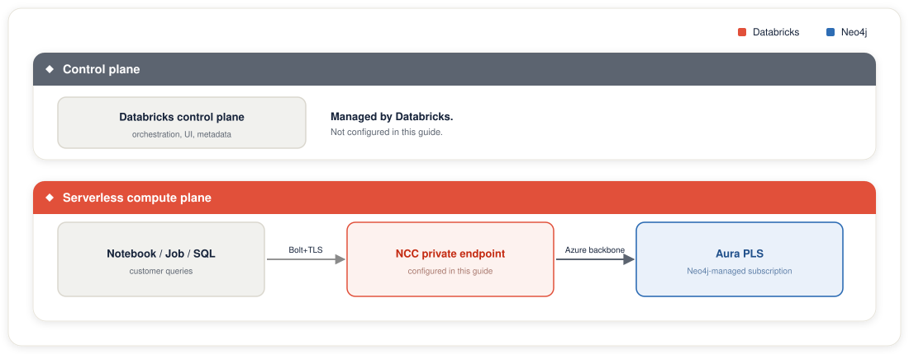
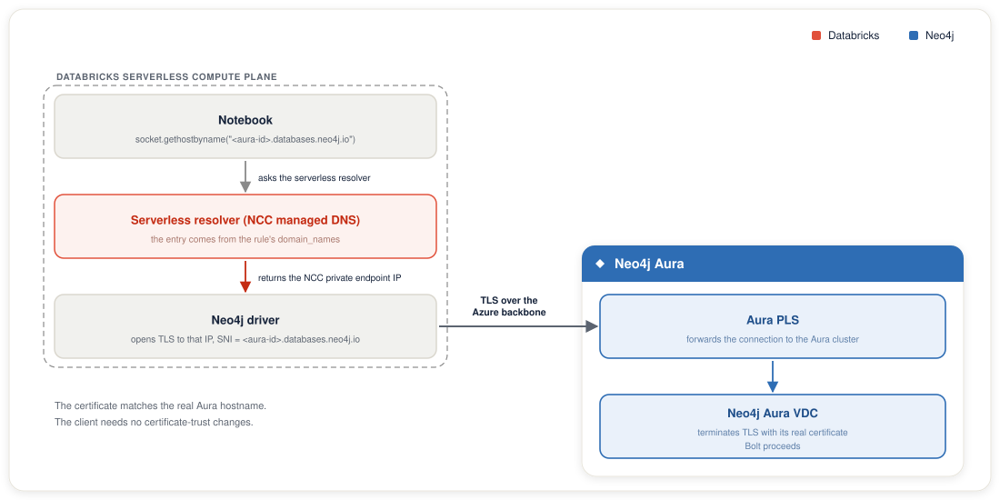
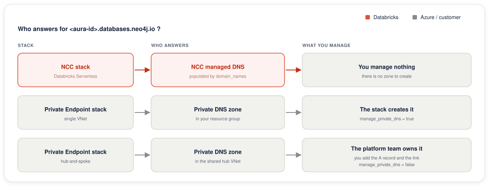

# Architecture

## Goal

Establish private, end-to-end Bolt+TLS connectivity between Azure Databricks Serverless compute and Neo4j Aura VDC on Azure, without any traffic leaving the Azure backbone.

## Why this architecture

### Why NCC instead of customer VNet

Azure Databricks Serverless compute runs in **Databricks-managed subscriptions**, not in your customer VNet. You cannot inject a customer-VNet-based private endpoint into serverless workloads the way you can with classic Databricks clusters. **Network Connectivity Configurations (NCC)** are the only supported method for giving serverless compute access to private resources.

An NCC is an **account-level, region-scoped** object that:

- Holds a set of private endpoint rules
- Attaches to one or more workspaces in the same region
- Manages DNS routing for the private endpoints from inside the serverless compute plane

### Why a REST API call for the private endpoint rule

The account console UI for private endpoint rules assumes an Azure-native resource: it asks for a Destination Azure resource ID (ARM ID) and a sub-resource ID (group ID). This works for first-party Azure services (Storage, Key Vault, SQL, etc.) where Microsoft publishes a known list of sub-resource types.

Neo4j Aura is a **third-party Private Link Service**. The PLS lives in Aura's own managed subscription, not yours. You never see an ARM ID for it. You see a **PLS alias** instead, which is the canonical way Azure exposes PLS to consumers across subscription boundaries.

Databricks' Network Connectivity API supports this case through the private endpoint rule payload: you pass `resource_id` (the PLS alias Aura gave you) and `domain_names` (the hostname clients will resolve). The `domain_names` field is the key piece: it tells NCC's managed DNS to route that hostname to the private endpoint instead of the public Aura IP.

The UI flow does not expose `domain_names`, which is why third-party PLS routing requires the API.

## Data plane vs control plane

Azure Databricks has two network planes that often get conflated:

| Plane | What flows through it | How it reaches resources |
|-------|----------------------|--------------------------|
| **Control plane** | Cluster orchestration, workspace UI, metadata | Managed by Databricks |
| **Serverless compute plane (data plane)** | Notebook/job/SQL compute, customer queries | Configurable via NCC: uses private endpoints when defined |

This guide configures the **serverless compute plane** to reach Aura privately. The control plane is managed by Databricks and is not part of this setup.

## DNS resolution flow

When a notebook executes `socket.gethostbyname("<aura-id>.databases.neo4j.io")`:

1. The serverless compute resolver receives the query
2. NCC's managed DNS has an entry for `<aura-id>.databases.neo4j.io` because you registered it as `domain_names` in the private endpoint rule
3. NCC returns the private IP of the private endpoint allocated for your NCC
4. The Neo4j driver opens a TLS connection to that private IP
5. The TLS handshake includes SNI `<aura-id>.databases.neo4j.io`
6. Traffic flows over the Azure backbone to Aura's PLS, which forwards it to the Aura cluster. The cluster terminates TLS using its real certificate
7. Bolt protocol proceeds normally

The TLS certificate is issued for the real Aura hostname, so no certificate-trust manipulation is needed on the client side.

## DNS ownership: who answers for the Aura hostname

The DNS flow above assumes *something* maps `<aura-instance-id>.databases.neo4j.io` to a private IP. Which "something" that is depends on the compute path, and this is the single most common source of "the PE is approved but nothing connects" confusion.

- **NCC stack (serverless).** DNS is not yours to manage. NCC holds a managed private-DNS layer inside the serverless compute plane, and the `domain_names` on the private endpoint rule is what populates it. There is no zone for you to create or link. See [the NCC stack](../infra/terraform/databricks-ncc/).

- **Private Endpoint stack.** DNS *is* yours. A Private Endpoint only allocates a private IP on a NIC; it does not make the hostname resolve. You need an Azure **private DNS zone** for `databases.neo4j.io` holding an A record for the instance host, plus a virtual-network link so resolvers in the consuming VNet see it. Without the A record the zone is empty and the hostname silently falls back to public resolution; the connection may still work, but it is not private.

For the Private Endpoint stack there are two topologies, and the distinction matters because it changes *who* creates the zone:

| Topology | Who owns `databases.neo4j.io` | Terraform setting |
|---|---|---|
| **Self-managed (single VNet)** | This stack, in your resource group | `manage_private_dns = true` (default) |
| **Central / hub-and-spoke** | A shared hub VNet (often behind Azure DNS Private Resolver); spokes consume it via peering + zone links | `manage_private_dns = false`: you add the A record and link in the hub |

Enterprises almost always centralize DNS: the hub owns every private zone and spokes are forbidden (by convention or Azure Policy) from creating their own. If this stack created a second `databases.neo4j.io` zone inside a spoke, resolution goes split-brain (two zones, one name, winner decided by which zone a VNet is linked to) or the apply is denied by policy. So `manage_private_dns = false` is the "defer to central DNS" switch: it provisions the PE only and hands DNS back to the platform team, who add the A record (pointing at the PE NIC IP) and the routing-host records in the hub.

The [Aura routing-hostname](troubleshooting.md#neo4j-driver-cannot-resolve-p-neo4jio) caveat applies to **both** topologies: Aura advertises `p-<dbid>-<suffix>.<orch>.neo4j.io` routing addresses after the first connection, and those must resolve to the same private IP. On the NCC stack they go in `aura_extra_domain_names`. On the Private Endpoint stack they become one A record per host in a private DNS zone for their `<orch>.neo4j.io` domain, because they do not sit under `databases.neo4j.io`. Setup and worked steps live in the [Private Endpoint stack setup](private-endpoint-stack-setup.md#routing-host-records).

## Supported resource categories in Databricks NCC

NCC private endpoints support many Azure services, such as Storage, Key Vault, SQL Database, and Event Hub. See [Supported resources](https://learn.microsoft.com/en-us/azure/databricks/security/network/serverless-network-security/manage-private-endpoint-rules#resources) for the current list.

Neo4j Aura falls under **Resources behind a Standard Load Balancer**. This category is the supported path for third-party Private Link providers, including Neo4j Aura.

## Region considerations

- The NCC region **must** match the Databricks workspace region (hard constraint)
- The Aura instance region can differ, but cross-region Private Link adds latency and traffic crosses Azure backbone between regions
- For latency-sensitive graph workloads, co-locate the workspace and Aura instance in the same Azure region

## Failure modes and recovery

| Failure | Symptom | Recovery |
|---------|---------|----------|
| Subscription not registered in the Aura network access configuration | PE creation in Azure succeeds but Aura never sees the request | Add the subscription ID in the Aura console ([Step 2](../README.md#step-2-enable-private-link-in-aura-network-access-configuration)), then re-create the rule ([Step 6](../README.md#step-6-add-a-private-endpoint-rule-for-neo4j-aura-pls)) |
| `domain_names` omitted in NCC rule | DNS resolves to public Aura IP; connection works but isn't private | Update the rule with a PATCH request (`?update_mask=domain_names`), then restart serverless |
| NCC attached but services not restarted | Existing sessions still use old routing | Restart all serverless compute (SQL warehouses, running jobs) |
| Rule expired (14 days in PENDING) | NCC rule disappears or is in `EXPIRED` state | Re-create the rule via API; re-approve in Aura console |
| Public access disabled before validation | Clients can't reach Aura at all | Re-enable public access temporarily; debug DNS/PE; then re-disable |

## Cost model

Azure Databricks bills for network egress when serverless workloads communicate with customer resources, including private-link traffic. Cross-region adds an extra premium. Plan for this in your TCO model. The cost is non-zero for high-throughput Delta-to-Neo4j syncs. See [Understand Databricks networking costs](https://learn.microsoft.com/en-us/azure/databricks/security/network/serverless-network-security/cost-management).
