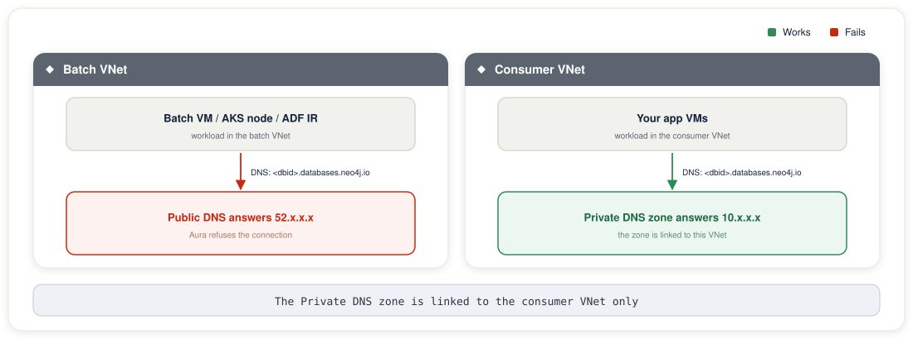

# Batch Jobs and Workloads in Other VNets

This guide applies to the Private Link path, where a private endpoint sits in your own VNet. When public access is disabled on Aura, a workload in a VNet that is not linked to the private DNS zone for `databases.neo4j.io` resolves the Aura hostname through public DNS. It receives the public IP, and Aura refuses the connection.

The commands use `PE_RG` and `PE_IP` from setup. Load them with `source scripts/load-env.sh`, as in [Environment setup](../env-setup.md).

The fixes below restore connectivity for Azure workloads in other VNets. Affected workloads include classic Databricks clusters, Azure Data Factory, Azure Kubernetes Service, Azure Machine Learning compute clusters, Azure Functions, and any VM-based batch process.

---

## Why it breaks



The Private DNS Zone `databases.neo4j.io` is linked to the consumer VNet only. Workloads in any other VNet resolve via public DNS until you explicitly link the zone to their VNet.

---

## Which fix to choose

| Scenario | Fix |
|----------|-----|
| Batch VNet is in the **same subscription** as the consumer VNet | [Option A](#option-a-add-a-vnet-link-to-the-private-dns-zone). Add a VNet link and VNet peering |
| Batch VNet is in a **different subscription** | [Option B](#option-b-create-a-new-private-endpoint-in-the-batch-vnet). Add subscription to Aura, deploy a new Private Endpoint |
| **Databricks Serverless** | Use the NCC path instead, with the [NCC manual setup](../setup-ncc-manual.md) or the [NCC Terraform setup](../setup-ncc-terraform.md). The NCC manages DNS independently |
| **Databricks classic (VNet-injected)** | Option A. Link the DNS zone to the Databricks VNet + peer VNets |

---

## Option A: Add a VNet link to the Private DNS Zone

A single Private Endpoint NIC is reachable from any peered VNet. Azure exports the endpoint NIC's subnet route across VNet peerings. The only missing piece is usually DNS: the Private DNS Zone must be explicitly linked to each VNet whose workloads need to resolve the Aura hostname.

### Step 1: Peer the batch VNet to the consumer VNet

If the batch VNet is not already peered to the consumer VNet:

```bash
# Consumer → Batch direction
az network vnet peering create \
  --name consumer-to-batch \
  --resource-group <consumer-rg> \
  --vnet-name <consumer-vnet> \
  --remote-vnet /subscriptions/<subscription-id>/resourceGroups/<batch-rg>/providers/Microsoft.Network/virtualNetworks/<batch-vnet> \
  --allow-vnet-access \
  --allow-forwarded-traffic

# Batch → Consumer direction (peering must be created both ways)
az network vnet peering create \
  --name batch-to-consumer \
  --resource-group <batch-rg> \
  --vnet-name <batch-vnet> \
  --remote-vnet /subscriptions/<subscription-id>/resourceGroups/<consumer-rg>/providers/Microsoft.Network/virtualNetworks/<consumer-vnet> \
  --allow-vnet-access \
  --allow-forwarded-traffic
```

Or with Terraform:

```hcl
resource "azurerm_virtual_network_peering" "consumer_to_batch" {
  name                      = "consumer-to-batch"
  resource_group_name       = var.consumer_resource_group
  virtual_network_name      = var.consumer_vnet_name
  remote_virtual_network_id = data.azurerm_virtual_network.batch.id
  allow_virtual_network_access = true
  allow_forwarded_traffic      = true
}

resource "azurerm_virtual_network_peering" "batch_to_consumer" {
  name                      = "batch-to-consumer"
  resource_group_name       = var.batch_resource_group
  virtual_network_name      = var.batch_vnet_name
  remote_virtual_network_id = data.azurerm_virtual_network.consumer.id
  allow_virtual_network_access = true
  allow_forwarded_traffic      = true
}
```

### Step 2: Add a VNet link to the Private DNS Zone

```bash
az network private-dns link vnet create \
  --resource-group <consumer-rg> \
  --zone-name "databases.neo4j.io" \
  --name "link-to-batch-vnet" \
  --virtual-network /subscriptions/<subscription-id>/resourceGroups/<batch-rg>/providers/Microsoft.Network/virtualNetworks/<batch-vnet> \
  --registration-enabled false
```

Or with Terraform:

```hcl
data "azurerm_virtual_network" "batch" {
  name                = var.batch_vnet_name
  resource_group_name = var.batch_resource_group
}

resource "azurerm_private_dns_zone_virtual_network_link" "batch" {
  name                  = "link-to-batch-vnet"
  resource_group_name   = var.consumer_resource_group
  private_dns_zone_name = "databases.neo4j.io"
  virtual_network_id    = data.azurerm_virtual_network.batch.id
  registration_enabled  = false
}
```

### Step 3: Validate DNS from the batch VNet

SSH or Bastion into any VM in the batch VNet and run:

```bash
nslookup <aura-instance-id>.databases.neo4j.io
```

The response must be the Private Endpoint NIC IP. It is usually a `10.x` address. A public IP means the VNet link was applied to the wrong zone, or the peering has not finished propagating. Allow 2 to 5 minutes for propagation, then check again.

### Step 4: Update the connection URI

The Aura credentials file uses the public hostname. Update batch job configuration to use the Private URI from the Aura console:

```
# Before (public, now refused)
NEO4J_URI=neo4j+s://<aura-instance-id>.databases.neo4j.io

# After (private: same hostname, routed via Private Endpoint)
NEO4J_URI=neo4j+s://<aura-instance-id>.databases.neo4j.io
```

> On Azure, the Private URI and the public URI share the same hostname, `<aura-instance-id>.databases.neo4j.io`. Only the DNS resolution changes. The private zone resolves it to the PE NIC IP. No hostname change in your connection string is required, unlike other cloud providers.

---

## Option B: Create a new Private Endpoint in the batch VNet

When the batch VNet is in a different Azure subscription, VNet linking alone is insufficient. You must create a new Private Endpoint in that subscription. A Private Link Service allows multiple consumers from different subscriptions.

### Step 1: Register the batch subscription in Aura

Open the Aura private endpoints page, as described in [Aura console Step 3](../shared/aura-console-steps.md#step-3-allow-list-the-consumer-subscription). Edit the network access configuration and add the batch subscription ID to the **Target Azure Subscription IDs** list. This allowlists incoming connection requests from the batch subscription.

### Step 2: Deploy a new Private Endpoint in the batch VNet

Deploy the [`azure-private-endpoint/` Terraform stack](../../infra/terraform/azure-private-endpoint/) a second time, with its own state. Do not apply the batch values in the existing stack directory with the existing state. The stack manages one endpoint per state, so Terraform would replace the primary endpoint with the batch one.

Copy the stack to a new directory. Remove any state, tfvars, and provider cache from the copy so it starts clean:

```bash
cp -R infra/terraform/azure-private-endpoint infra/terraform/azure-private-endpoint-batch
rm -rf infra/terraform/azure-private-endpoint-batch/.terraform \
  infra/terraform/azure-private-endpoint-batch/terraform.tfstate* \
  infra/terraform/azure-private-endpoint-batch/terraform.tfvars
```

Create `infra/terraform/azure-private-endpoint-batch/batch.tfvars` with values for the batch subscription. The PLS alias is the same one the primary endpoint uses:

```hcl
azure_subscription_id = "<batch-subscription-id>"
azure_tenant_id       = "<tenant-id>"
resource_group_name   = "<batch-resource-group>"
virtual_network_name  = "<batch-vnet>"
pe_subnet_name        = "<batch-pe-subnet>"
private_endpoint_name = "pe-neo4j-aura-batch"
aura_pls_alias        = "production-orch-<id>-service.<guid>.<region>.azure.privatelinkservice"
aura_instance_id      = "<aura-instance-id>"
manage_private_dns    = true
```

Initialize and apply the copy with that file:

```bash
terraform -chdir=infra/terraform/azure-private-endpoint-batch init
terraform -chdir=infra/terraform/azure-private-endpoint-batch apply -var-file="batch.tfvars"
```

A Terraform workspace is the alternative to a copied directory. Run `terraform workspace new batch` in the original stack directory, then pass `-var-file="batch.tfvars"` to every plan and apply. Check `terraform workspace show` before each apply, because the `default` workspace still holds the primary endpoint.

### Step 3: Approve the connection in the Aura console

The new Private Endpoint creates a pending connection request in Aura.

1. Open the Aura private endpoints page, as described in [Aura console Step 4](../shared/aura-console-steps.md#step-4-approve-the-private-endpoint-in-the-aura-console)
2. Locate the pending request from the batch subscription
3. Click **Accept**
4. Wait for status to reach **Approved**

Validate DNS from the batch VNet:

```bash
nslookup <aura-instance-id>.databases.neo4j.io
```

The answer must be the new PE NIC IP in the batch VNet.

---

## Workload-specific configuration

### Classic Azure Databricks (VNet-injected)

Databricks VNet-injected clusters run in a customer-managed VNet. Apply Option A to link the DNS zone to the Databricks VNet and peer it with the consumer VNet. Verify from a cluster notebook:

```python
import socket
print(socket.gethostbyname("<aura-instance-id>.databases.neo4j.io"))  # expect 10.x.x.x
```

### Azure Data Factory: Self-hosted Integration Runtime

The self-hosted IR is a VM or a VM Scale Set in your VNet. Apply Option A for the IR's VNet. Update the ADF linked service connection string to the Private URI.

For an **Azure-hosted IR**, network access goes through Microsoft-managed infrastructure that cannot be VNet-peered. Use a **self-hosted IR** instead, or route via the Managed VNet IR if ADF Managed Virtual Network is enabled in your workspace.

### Azure Kubernetes Service (AKS)

AKS nodes run in the AKS node VNet. Apply Option A for the node VNet. Confirm CoreDNS resolves correctly from inside a pod:

```bash
kubectl run dns-test --image=busybox --restart=Never --rm -it -- \
  nslookup <aura-instance-id>.databases.neo4j.io
```

Expect the PE NIC IP. If CoreDNS returns the public IP, the node VNet may use a custom DNS server that does not forward to Azure DNS at `168.63.129.16`. Check the AKS cluster's DNS configuration.

### Azure Machine Learning Compute Clusters

ML compute clusters in a managed or customer VNet need the DNS zone linked to their VNet. For **AzureML Managed VNets**, add an outbound private endpoint rule in the AzureML workspace Network settings that targets the Aura PLS alias directly. This works like the Databricks NCC approach.

### Azure Functions and App Service (VNet Integration)

Functions connected via **VNet Integration** route outbound traffic through your VNet. Apply Option A for the integrated VNet. Then enable **Route All** under VNet Integration settings, so all egress goes through the VNet. That egress includes DNS.

```bash
az functionapp vnet-integration add \
  --resource-group <rg> \
  --name <function-app-name> \
  --vnet <batch-vnet-name> \
  --subnet <integration-subnet>

az resource update \
  --resource-group <rg> \
  --name <function-app-name>/config/web \
  --resource-type Microsoft.Web/sites \
  --set properties.vnetRouteAllEnabled=true
```

### Azure Batch

Azure Batch pools deployed in a VNet subnet use the VNet's DNS. Apply Option A for the Batch pool VNet, then reference the Private URI in the pool's task environment variables.

---

## Multiple Aura instances in the same VNet

Each Aura instance needs its own A record in the `databases.neo4j.io` private DNS zone. The zone is shared. You add one record per instance, not one zone per instance.

Changing `aura_instance_id` in an existing stack does not add a second record. Terraform replaces the existing A record, so the first instance stops resolving privately.

For a second instance, add its A record to the existing zone by hand. Point it at the private endpoint IP that serves the instance. `PE_RG` is the resource group that holds the zone. `PE_IP` is the endpoint IP from [Private Link manual setup Step 4](../setup-private-link-manual.md#step-4-check-the-connection-status):

```bash
az network private-dns record-set a create \
  --resource-group "$PE_RG" --zone-name databases.neo4j.io \
  --name "<second-aura-instance-id>" --ttl 30

az network private-dns record-set a add-record \
  --resource-group "$PE_RG" --zone-name databases.neo4j.io \
  --record-set-name "<second-aura-instance-id>" \
  --ipv4-address "$PE_IP"
```

If the second instance needs its own endpoint, deploy it as a separate stack with its own state, as in [Option B Step 2](#step-2-deploy-a-new-private-endpoint-in-the-batch-vnet). Set `manage_private_dns = false` in that stack so it does not create a second `databases.neo4j.io` zone. Then add the A record to the existing zone with the commands above.

---

## Troubleshooting

| Symptom | Cause | Fix |
|---------|-------|-----|
| `nslookup` returns public IP from batch VM | DNS zone not linked to batch VNet | Add VNet link (Option A Step 2) |
| VNet link exists but `nslookup` still returns public IP | Peering not established; DNS traffic not reaching the zone | Confirm peering is in **Connected** state; also check that the batch VM's DNS is Azure DNS at `168.63.129.16` |
| PE connection request stuck in **Pending** in Aura | Batch subscription not in Aura's subscription allowlist | Add batch subscription ID in the Aura private endpoints page (Option B Step 1) |
| AKS CoreDNS returns public IP despite VNet link | AKS uses custom DNS server not forwarding to Azure DNS | Add a conditional forwarder for `databases.neo4j.io` to `168.63.129.16` in the custom DNS server |
| Databricks NCC rule stays **PENDING** | Databricks-managed subscription ID missing from the Aura allow-list, or the request is unapproved | Follow [NCC rule stuck in PENDING](troubleshooting.md#ncc-rule-stuck-in-pending) |
| Connection refused from ADF Azure IR | Azure IR cannot be peered to customer VNet | Switch to self-hosted IR in the batch VNet |
