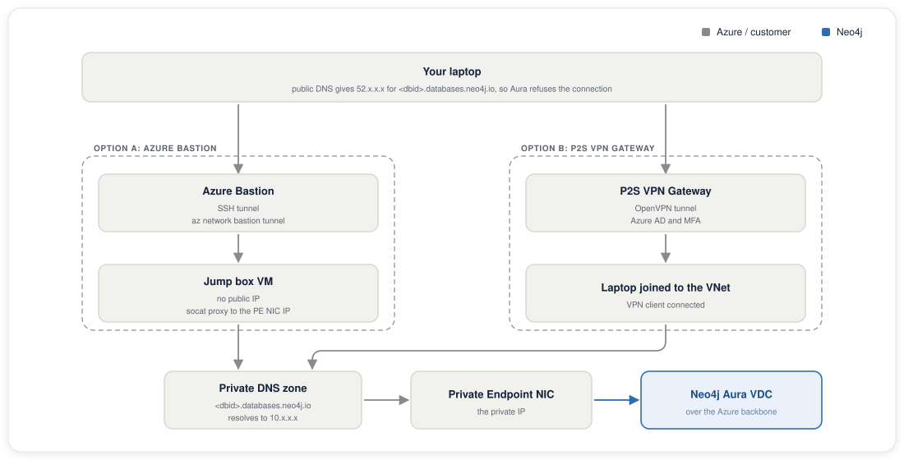
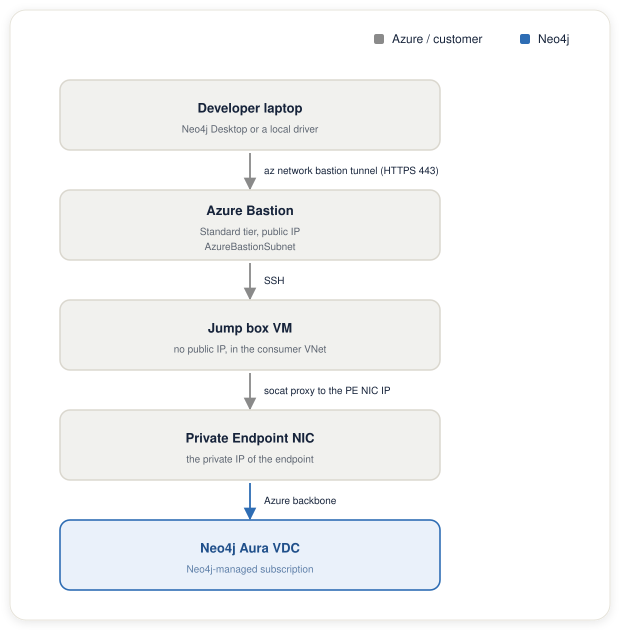
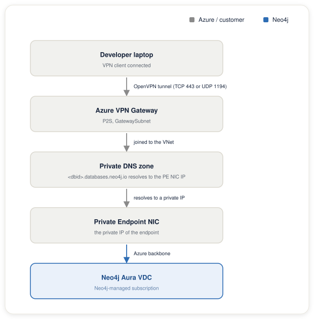

# Developer Desktop Access After Disabling Public Traffic

This guide applies to the Private Link path. Both options below reach Aura through a private endpoint in your own VNet. The NCC path has no endpoint in your VNet, because Databricks creates and manages the NCC endpoint. NCC users must first build an endpoint with the Private Link setup, either the [manual setup](../setup-private-link-manual.md) or the [Terraform setup](../setup-private-link-terraform.md).

---

## Start here: use what your organization already uses

Ask your network, infrastructure, or security team one question:

> **"How do developers in other teams access private resources in Azure today?"**

Most organizations that run workloads in Azure already have an approved, audited method for private access. It may be a corporate VPN, a jump host pattern, an Azure Bastion policy, or a Point-to-Site VPN that developers use to reach internal databases, Key Vault, or private APIs. If that method exists, use it. Connect Neo4j Desktop or your browser the same way those teams connect to their private Azure resources. There is no need to introduce new tooling, and doing so may conflict with your organization's security policy or approved-software list.

Common patterns already in use at organizations that run Azure:

| If your teams currently use… | Do the same for Neo4j |
|------------------------------|-----------------------|
| A corporate VPN that gives access to Azure private resources, such as Cisco AnyConnect, Palo Alto GlobalProtect, or Zscaler | Connect via the same VPN. Once on it, Neo4j Desktop connects to the private URI directly |
| Azure Point-to-Site VPN over OpenVPN or IKEv2 | Use the same VPN connection. Link the existing Private DNS Zone to your VNet if not already done |
| Azure Bastion to access jump box VMs | Use the same Bastion setup with SSH port-forwarding. Option A below follows this pattern |
| ExpressRoute or Site-to-Site VPN from your office or data centre | The Neo4j Private Endpoint is reachable from any machine whose traffic routes through the connected VNet |
| Nothing yet: this is the first private Azure workload | Use Option B, an Azure P2S VPN with OpenVPN. It is Azure-native, integrates with Azure AD and MFA, and is widely accepted in regulated industries |

Only continue to the options below if your organization does not already have a standard method, or if your security team has asked you to evaluate one of the documented patterns.

---

## How it works



---

## Option A: Azure Bastion + SSH Tunnel

Azure Bastion is Microsoft's managed SSH/RDP proxy. The jump box VM that Bastion connects to has no public IP. The Bastion host itself has a public IP, but that is an Azure-managed resource. Your developers never SSH directly to a VM IP.

**Standard tier is required.** Basic Bastion only exposes a browser-based terminal. Standard tier adds `az network bastion tunnel`, which opens a local TCP port that lets a desktop SSH client connect. This is necessary for port-forwarding Neo4j traffic.

### What you will build



### Step 1: Deploy the jump box and Bastion

This repo includes a Terraform module at [`infra/terraform/jumpbox/`](../../infra/terraform/jumpbox/). The module has no provider block, so it runs inside the [private endpoint stack](../../infra/terraform/azure-private-endpoint/). Create `infra/terraform/azure-private-endpoint/jumpbox.tf` with this content:

```hcl
variable "ssh_public_key" {
  description = "SSH public key for the jump box admin user."
  type        = string
}

module "jumpbox" {
  source = "../jumpbox"

  resource_group_name = var.resource_group_name
  location            = data.azurerm_virtual_network.this.location
  vnet_name           = var.virtual_network_name
  vnet_resource_group = data.azurerm_virtual_network.this.resource_group_name
  jump_subnet_name    = "jump-subnet"    # must already exist, /28 or larger
  bastion_subnet_cidr = "10.0.255.0/26"  # AzureBastionSubnet: /26 is minimum
  pe_nic_ip           = azurerm_private_endpoint.aura.private_service_connection[0].private_ip_address
  ssh_public_key      = var.ssh_public_key
  neo4j_ports         = [7687, 7474, 7473, 8491]
  tags                = var.tags
}

output "jumpbox_resource_id" {
  value = module.jumpbox.jumpbox_resource_id
}

output "bastion_name" {
  value = module.jumpbox.bastion_name
}

output "bastion_tunnel_command" {
  value = module.jumpbox.bastion_tunnel_command
}

output "ssh_port_forward_command" {
  value = module.jumpbox.ssh_port_forward_command
}
```

`pe_nic_ip` reads the endpoint NIC IP straight from the stack, so you do not copy it by hand. Add `ssh_public_key` to your `terraform.tfvars`. Paste the contents of the public key file, such as `~/.ssh/id_rsa.pub`, as a string. Keep the matching private key. Step 4 uses it.

If you built the endpoint without Terraform, there is no stack to add the file to. Create a new root directory with an `azurerm` provider block and the `module "jumpbox"` block above. Set `source` to the path of `infra/terraform/jumpbox/` from that directory. Replace the variables with literal values, and set `pe_nic_ip` to the IP string from [Private Link manual setup Step 4](../setup-private-link-manual.md#step-4-check-the-connection-status). The script prints the same IP when you run `uv run scripts/private_link.py status`.

The module creates these resources:

- An `AzureBastionSubnet` with the CIDR you provide. Azure requires this exact subnet name.
- A public IP for the Bastion host. Azure Bastion requires one, and your VMs do not.
- An Azure Bastion host on the Standard SKU.
- A jump box Linux VM of size Standard_B1s, with no public IP.
- socat systemd proxy services for each Neo4j port, forwarding to the PE NIC IP.
- An NSG allowing SSH inbound only from `AzureBastionSubnet`.

Initialize again so Terraform loads the new module, then apply:

```bash
terraform -chdir=infra/terraform/azure-private-endpoint init
terraform -chdir=infra/terraform/azure-private-endpoint apply
```

The apply prints the jump box resource ID. You need it in Step 3:

```
jumpbox_resource_id = "/subscriptions/.../virtualMachines/neo4j-jumpbox"
```

Read it again later with `terraform -chdir=infra/terraform/azure-private-endpoint output -raw jumpbox_resource_id`. The `bastion_tunnel_command` and `ssh_port_forward_command` outputs print the full commands for Steps 3 and 4.

### Step 2: Add the Aura hostname to your hosts file

The jump box's socat proxies forward to the Private Endpoint NIC IP. Neo4j Desktop and browsers verify the TLS certificate against the **hostname in your connection URI**, not the IP. To make TLS verify correctly while routing traffic through the local tunnel, map the hostname to `127.0.0.1` on your laptop.

Open your hosts file as administrator:

- **macOS / Linux:** The hosts file is `/etc/hosts`.
- **Windows:** The hosts file is `C:\Windows\System32\drivers\etc\hosts`.

Add one line that maps your Aura instance hostname to `127.0.0.1`:

```
127.0.0.1  <aura-instance-id>.databases.neo4j.io
```

> Remove this line when you no longer need the tunnel. While it is present, every DNS lookup for that hostname on your laptop resolves to `127.0.0.1`.

### Step 3: Open the Bastion tunnel

Run this in a dedicated terminal. The terminal must stay open. Replace the placeholders with your values from `terraform output`:

```bash
az network bastion tunnel \
  --name neo4j-bastion \
  --resource-group <resource-group> \
  --target-resource-id <jumpbox_resource_id> \
  --resource-port 22 \
  --port 2222
```

This opens `localhost:2222` as a proxy to port 22 on the jump box via Azure Bastion. Leave this terminal running.

### Step 4: Open the Neo4j port forwards

In a second terminal:

```bash
ssh -i ~/.ssh/id_rsa \
  -L 7687:localhost:7687 \
  -L 7474:localhost:7474 \
  -L 7473:localhost:7473 \
  -N -p 2222 \
  azureuser@127.0.0.1
```

This SSH session connects through the Bastion tunnel and port-forwards Neo4j traffic: local port → jump box `localhost` → socat → Private Endpoint NIC IP → Aura. The `-N` flag keeps it open without a shell. Leave this terminal running too.

### Step 5: Connect Neo4j Desktop

Open Neo4j Desktop and add a remote connection:

| Field       | Value                                                 |
| ----------- | ----------------------------------------------------- |
| Connect URL | `bolt+s://<aura-instance-id>.databases.neo4j.io:7687` |
| Username    | `neo4j`, or your Aura username                        |
| Password    | your Aura password                                    |

The traffic follows this path:

1. Desktop resolves `<aura-instance-id>.databases.neo4j.io` to `127.0.0.1` through the hosts file.
2. TCP connects to `127.0.0.1:7687` → SSH tunnel → jump box `localhost:7687`.
3. Jump box socat → PE NIC IP:7687 → Aura.
4. Aura presents a TLS certificate for `*.databases.neo4j.io`. Desktop verifies it against `<aura-instance-id>.databases.neo4j.io`, and the check passes.

### Access Neo4j Browser in Chrome

Navigate to:

```
https://<aura-instance-id>.databases.neo4j.io:7474
```

The browser uses the same route through the `:7474` leg of the tunnel.

### Closing the tunnel

Kill both terminal processes when done. Remove the `/etc/hosts` line once closed.

---

## Option B: Azure Point-to-Site VPN Gateway (OpenVPN)

**This is the recommended option for financial services, insurance, and regulated industries.** Azure P2S VPN is a Microsoft-managed service that:

- Uses the **OpenVPN protocol**, which compliance and security teams in regulated sectors widely accept
- Integrates with **Azure Active Directory** for authentication, enabling **MFA via Conditional Access** policies
- Produces full audit trails in **Azure Monitor** and Log Analytics
- Holds compliance certifications for **ISO 27001, SOC 1/2, PCI DSS, FedRAMP**
- Requires **no VM to manage**, because Microsoft operates the gateway infrastructure

When connected, your laptop joins the VNet as a full participant. The Private DNS Zone linked to that VNet resolves `<aura-instance-id>.databases.neo4j.io` to the Private Endpoint NIC IP automatically. Neo4j Desktop, browsers, and any driver connect with the Private URI as-is, with no hosts file changes and no tunnel window to keep open.

### Architecture



### Prerequisites

- An Azure VNet with a dedicated `GatewaySubnet`. Size it at `/27`. Smaller deployments can use `/28`.
- A VPN Gateway on the **VpnGw1** SKU or higher. P2S with OpenVPN requires at least VpnGw1.
- Azure AD global admin or Application Administrator access, for Azure AD auth. Certificate-based auth needs a CA certificate instead.

> **Provisioning note:** VPN Gateways take **30 to 45 minutes** to deploy. Plan accordingly and do not cancel the apply mid-run.

### Option B-1: Azure AD authentication

Azure AD authentication is the recommended choice for enterprise teams. It ties each VPN connection to an Entra ID identity. MFA and Conditional Access policies apply automatically.

**Terraform snippet:** This Terraform creates the gateway subnet, a public IP, and a P2S gateway that authenticates with Azure AD:

```hcl
resource "azurerm_subnet" "gateway" {
  name                 = "GatewaySubnet"   # must be exactly this name
  resource_group_name  = var.resource_group_name
  virtual_network_name = var.virtual_network_name
  address_prefixes     = ["10.0.254.0/27"]
}

resource "azurerm_public_ip" "vpn_gw" {
  name                = "neo4j-vpngw-pip"
  resource_group_name = var.resource_group_name
  location            = var.location
  allocation_method   = "Static"
  sku                 = "Standard"
}

resource "azurerm_virtual_network_gateway" "p2s" {
  name                = "neo4j-vpn-gw"
  resource_group_name = var.resource_group_name
  location            = var.location
  type                = "Vpn"
  vpn_type            = "RouteBased"
  sku                 = "VpnGw1"
  active_active       = false
  enable_bgp          = false

  ip_configuration {
    name                          = "vnetGatewayConfig"
    public_ip_address_id          = azurerm_public_ip.vpn_gw.id
    private_ip_address_allocation = "Dynamic"
    subnet_id                     = azurerm_subnet.gateway.id
  }

  vpn_client_configuration {
    address_space = ["172.16.0.0/24"]   # IP pool for VPN clients; must not overlap your VNet

    vpn_client_protocols = ["OpenVPN"]

    aad_tenant   = "https://login.microsoftonline.com/<your-tenant-id>/"
    aad_audience = "41b23e61-6c1e-4545-b367-cd054e0ed4b4"  # Azure VPN client app ID
    aad_issuer   = "https://sts.windows.net/<your-tenant-id>/"
  }
}
```

**Connect developers:** Each developer connects through the Azure VPN Client with these steps.

1. In the Azure portal, navigate to your VPN Gateway → **Point-to-site configuration**.
2. Click **Download VPN client**. This produces a zip with OpenVPN config profiles.
3. Developers install the **Azure VPN Client** on Windows or macOS and import the profile.
4. They authenticate with their Entra ID credentials and MFA.
5. Once connected, `<aura-instance-id>.databases.neo4j.io` resolves to the PE NIC IP.
6. Neo4j Desktop connects to `bolt+s://<aura-instance-id>.databases.neo4j.io:7687` directly.

### Option B-2: Certificate-based authentication

If Azure AD is not available, use mutual TLS certificates. Generate a root CA and issue per-developer client certificates. Upload the root CA public key to the VPN Gateway. Developers import their client certificate into the VPN client.

```hcl
vpn_client_configuration {
  address_space        = ["172.16.0.0/24"]
  vpn_client_protocols = ["OpenVPN"]

  root_certificate {
    name             = "neo4j-vpn-root-ca"
    public_cert_data = file("certs/root-ca-public.pem")  # base64, no headers
  }
}
```

Certificate authentication is simpler to deploy but lacks the MFA capability and the centralised revocation that Azure AD provides. For regulated industries, Azure AD auth is strongly preferred.

---

## Option comparison

| | Option A: Azure Bastion | Option B: P2S VPN with OpenVPN |
|---|---|---|
| Public IP required | On the Azure-managed Bastion host | On the Azure-managed VPN Gateway |
| VMs to manage | Jump box VM | None |
| DNS managed automatically | No, hosts file required | Yes, Private DNS Zone resolves natively |
| Tunnel command to keep open | Yes, in two terminals | No, VPN client handles reconnects |
| Authentication | SSH key | Azure AD with MFA is recommended. Certificates also work |
| Audit trail | SSH logs on jump box | Azure Monitor / Log Analytics |
| FIPS 140-2 | Not applicable | Yes, Azure-managed |
| Regulatory acceptance | Limited | Widely accepted in finance and insurance |
| Approximate monthly cost | ~£25 for Bastion Standard plus ~£5 for the VM | ~£140 for VpnGw1 |
| Provisioning time | ~5 minutes | ~40 minutes for the gateway |

**For developer teams that connect regularly, or for any deployment in a regulated environment, Option B is the right choice.** Option A suits ad-hoc access or environments where P2S VPN licensing is not available.

---

## Troubleshooting

| Symptom | Cause | Fix |
|---------|-------|-----|
| `az network bastion tunnel` fails with "Bastion not found" | Wrong resource group or name | Confirm `terraform output bastion_name` and the RG |
| `az network bastion tunnel` requires Standard SKU error | Bastion is Basic tier | Upgrade to Standard in the portal or via Terraform SKU change |
| Neo4j Desktop shows TLS error | Hosts file entry missing or wrong hostname | Confirm `/etc/hosts` entry matches the Aura instance hostname exactly |
| Neo4j Desktop shows "connection refused" | SSH port-forward not running | Confirm the second terminal from Step 4 is still open |
| socat not proxying on jump box | Startup script did not finish | SSH to jump box via Bastion and run `systemctl status neo4j-proxy-7687` |
| VPN connects but `<aura-instance-id>.databases.neo4j.io` resolves to public IP | Private DNS Zone not linked to VNet | In Azure portal, check the DNS zone's VNet links. The VPN client subnet must be in the linked VNet |
| VPN authentication fails with Azure AD | Conditional Access policy blocking | Check the sign-in logs in Entra ID for the blocked policy. A common cause is a device compliance requirement |
