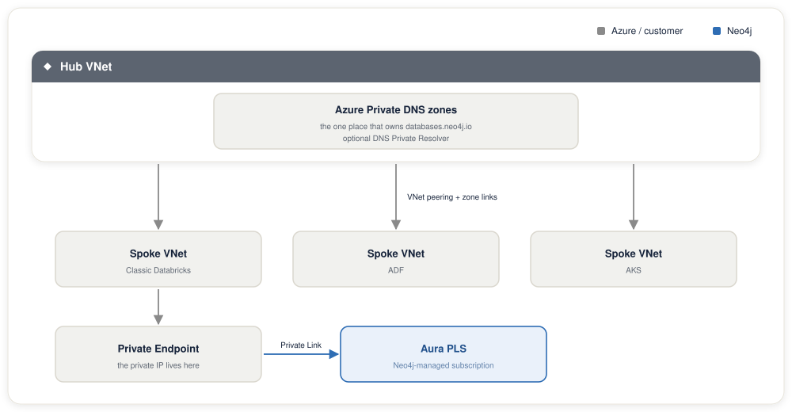

# Private Link Terraform setup

This guide sets up a Private Endpoint in your VNet into Aura's Private Link Service, plus the private DNS zone wiring required for the Aura hostname to resolve to the PE NIC. To do the same steps by hand with the Azure CLI, see [Private Link manual setup](setup-private-link-manual.md). Complete [Aura console Steps 1 to 3](shared/aura-console-steps.md) first.

Use this stack (the **Private Endpoint stack**) when your consumer is **not** Databricks Serverless. Typical fits:

- Classic Azure Databricks clusters (VNet-injected workspaces)
- Azure Data Factory self-hosted IR
- AKS workloads
- Jump VMs / Bastion-fronted admin hosts
- Azure Functions on VNet integration

For **Azure Databricks Serverless**, use the **NCC stack** [`infra/terraform/databricks-ncc/`](../infra/terraform/databricks-ncc/) instead, as described in [Terraform and automated NCC setup](setup-ncc-terraform.md). Serverless compute runs in Databricks-managed subscriptions and cannot consume a customer-VNet private endpoint.

In the Private Endpoint stack, you create the endpoint in your own VNet, so you also own DNS. The Terraform for this stack lives in [`infra/terraform/azure-private-endpoint/`](../infra/terraform/azure-private-endpoint/).

This stack has been validated end-to-end from a Windows VM in East US to an Aura instance in UK South. See [`screenshots/`](../screenshots/) for the captured walkthrough, including the Aura-side approval, the `Disable public traffic` lockdown, the VM's `nslookup` resolving to the PE NIC, and a working Neo4j Browser session over the private path.

## What this stack creates

| Resource | Purpose |
|---|---|
| `azurerm_private_endpoint` | The PE NIC inside your subnet that connects to Aura's PLS via alias |
| `azurerm_private_dns_zone` (`databases.neo4j.io`) | Private DNS zone for the Aura hostname (optional, see `manage_private_dns`) |
| `azurerm_private_dns_zone_virtual_network_link` | Links the zone to your VNet so resolvers in that VNet see it |
| `azurerm_private_dns_a_record` | Maps `<aura-instance-id>.databases.neo4j.io` to the PE NIC IP |

## Prerequisites

- Terraform >= 1.6.0
- An existing VNet and subnet that will host the PE NIC. The subnet must allow private endpoints (default for modern subnets).
- The subscription you are deploying into is **already registered** in the Aura console under **Target Azure Subscription IDs** ([Aura console Step 2](shared/aura-console-steps.md#step-2-enable-private-link-in-aura-network-access-configuration)). Paste your own subscription ID(s) there, not a Databricks-managed one. Without this, the PLS connection request will not appear in Aura for approval.
- Azure credentials (CLI login, environment variables, or managed identity) with permission to create PEs and private DNS zones in the target RG.

### Find your Azure subscription ID

Aura's network access configuration asks for the Azure subscription ID where the private endpoint will be created. Look it up before you start:

- **Azure portal:** Open **Subscriptions**, select your subscription, and copy the **Subscription ID** from the Overview page.
- **Azure CLI:** Run `az account show --query id -o tsv` for the active subscription, or `az account list --query "[].{name:name, id:id}" -o table` to list all of them.

## Usage

```bash
cd infra/terraform/azure-private-endpoint
cp terraform.tfvars.example terraform.tfvars
# Edit terraform.tfvars
terraform init
terraform plan
terraform apply
```

After apply:

1. Approve the incoming endpoint in the Aura console (see [Aura console Step 4](shared/aura-console-steps.md#step-4-approve-the-private-endpoint-in-the-aura-console)).
2. Verify resolution from any VM in the linked VNet:
   ```bash
   nslookup <aura-instance-id>.databases.neo4j.io
   ```
   The answer must be a private IP from the PE subnet.
3. Open a Bolt connection (`neo4j+s://<aura-instance-id>.databases.neo4j.io`) to confirm end-to-end traffic.

## Definitions

Terms used throughout this guide:

- **Private Endpoint (PE):** A network interface that Azure places inside one of your subnets. It holds a private IP and forwards traffic across Azure's backbone to Aura's Private Link Service, so Aura traffic stays off the public internet.
- **PE NIC:** The network interface card of that Private Endpoint. It is the object that actually owns the private IP.
- **Private IP:** The address assigned to the PE NIC from your own VNet's address range, such as `10.x.x.x`. Every reference to "the private IP" or "the PE private IP" in this guide means this one address. It is what the Aura hostname must resolve to for private connectivity to work.
- **PE subnet:** The subnet that hosts the PE NIC. Its address range determines which private IP the endpoint receives.
- **PLS (Private Link Service):** The Aura-side endpoint your Private Endpoint connects to. Neo4j publishes it as an alias that you approve from the Aura console.
- **Private DNS zone:** An Azure resource that answers DNS queries for a specific domain name, but only for the VNets you link to it. It overrides public DNS for that name inside your network.
- **VNet:** An Azure Virtual Network. **Hub** and **spoke** describe a topology where one central VNet, the hub, owns shared services like DNS, and workload VNets, the spokes, connect to it over peering.

### Why `databases.neo4j.io` lives in *your* private DNS zone

`databases.neo4j.io` is a Neo4j-owned domain, so creating a private DNS zone with that name inside your subscription can look like you are taking over someone else's domain. You are not. A private DNS zone is a local override, not public ownership:

- It applies only to the VNets you explicitly link to it. Nothing outside your network sees it.
- It does not change global or public DNS, and it registers nothing with Neo4j or any domain registrar.
- Its whole purpose is to intercept the Aura hostname *inside your network* and answer with the PE's private IP. The rest of the world still resolves the same hostname to Aura's public IP.

This is the standard Azure Private Link pattern. To make access to a service private, you create a private DNS zone whose name matches that service's public hostname, so queries from your VNet land on your Private Endpoint instead of the public address. You use Neo4j's domain name precisely because your applications connect to Neo4j's hostname: the record has to match `databases.neo4j.io` for the interception to work. Your own domain would not help, because the Aura driver always connects to `<aura-instance-id>.databases.neo4j.io`.

## Notes

- The `is_manual_connection = true` flag is required for cross-subscription PLS like Aura: the consumer side cannot auto-approve the connection.
- `private_connection_resource_alias` is the canonical handle Aura publishes. Do not attempt to use an ARM resource ID for Aura's PLS. There isn't one from your side.
- Public access on the Aura instance should be disabled **after** validation succeeds end-to-end, not before, to avoid locking yourself out during debugging.

## Private DNS: self-managed vs. central (hub-and-spoke)

A Private Endpoint gives you a private IP inside your subnet, but on its own nothing connects the Aura hostname to that IP. By default `<aura-instance-id>.databases.neo4j.io` resolves to Aura's public IP. A **private DNS zone** overrides that answer inside your network so the hostname resolves to the PE's private IP instead. This stack can create and own that zone for you, or leave DNS to a system you already run. The `manage_private_dns` variable chooses between those two modes.

### `manage_private_dns = true` (default, single VNet)

Terraform creates and owns the full DNS path:

- an `azurerm_private_dns_zone` named `databases.neo4j.io`,
- an `azurerm_private_dns_zone_virtual_network_link` linking that zone to your VNet,
- an `azurerm_private_dns_a_record` mapping `<aura-instance-id>` to the PE NIC IP,
- a `private_dns_zone_group` on the PE for auto-registration.

This mode suits a single VNet with no centralized DNS. Terraform creates only the instance A record. If Aura returns routing hosts after the first connection, add their records by hand as described in [Routing-host records](#routing-host-records), using your own resource group and VNet.

### `manage_private_dns = false` (central DNS / hub-and-spoke)

Larger Azure estates centralize DNS: one **hub** VNet owns the private DNS zones (often fronted by Azure DNS Private Resolver), and **spoke** VNets consume them over peering and zone links. In that model the hub owns `databases.neo4j.io`, and a spoke must never create its own copy of that zone:



If this stack tried to create a `databases.neo4j.io` zone in a spoke, one of two things breaks:

1. **Split-brain resolution:** two zones with the same name, and which one wins depends on which zone a given VNet happens to be linked to.
2. **Policy denial:** many orgs enforce Azure Policy that forbids creating private DNS zones outside the hub, so `terraform apply` fails outright.

Setting `manage_private_dns = false` makes this stack create **only the Private Endpoint**. It skips the zone, the VNet link, the A record, *and* the PE's `private_dns_zone_group` (see [`main.tf`](../infra/terraform/azure-private-endpoint/main.tf)). You then own DNS in your **hub** zone.

The steps below use the Azure CLI. Portal equivalents live under *Private DNS zones* and *DNS Private Resolver* in the portal, and the same objects map cleanly to your own Terraform or Bicep if the hub is codified. Set these shell values first, then work through the steps:

```bash
HUB_RG=<hub-resource-group>          # RG that owns the private DNS zones
ZONE=databases.neo4j.io              # the zone the hub owns
AURA_HOST=<aura-instance-id>         # e.g. abcd1234 (the label, not the FQDN)
PE_IP=$(terraform output -raw private_endpoint_nic_ip)   # from this stack, after apply
```

**Step 1: Confirm the hub owns the `databases.neo4j.io` zone.**
The platform team normally already runs this zone. Only create it if it does not exist, and only in the hub RG, never in a spoke:

```bash
az network private-dns zone show  --resource-group "$HUB_RG" --name "$ZONE" \
  || az network private-dns zone create --resource-group "$HUB_RG" --name "$ZONE"
```

**Step 2: Link the zone to every consuming VNet.**
Each spoke VNet whose workloads reach Aura must resolve against the hub zone. Add a virtual-network link per spoke with auto-registration **off**, because you are managing these records by hand:

```bash
az network private-dns link vnet create \
  --resource-group "$HUB_RG" \
  --zone-name "$ZONE" \
  --name link-<spoke-name> \
  --virtual-network <spoke-vnet-resource-id> \
  --registration-enabled false
```

If the hub fronts DNS with **Azure DNS Private Resolver**, spokes usually do not hold per-zone links at all. They point their VNet DNS at the resolver inbound endpoint, and a forwarding ruleset sends `databases.neo4j.io` to the hub. In that model this step is already handled by the standing platform pattern, and you skip straight to the A record.

**Step 3: Add the instance A record.**
Map the Aura host label to the PE NIC private IP inside the hub zone:

```bash
az network private-dns record-set a add-record \
  --resource-group "$HUB_RG" \
  --zone-name "$ZONE" \
  --record-set-name "$AURA_HOST" \
  --ipv4-address "$PE_IP"
```

**Step 4: Add the routing-host records.**
Routing hosts live in a different domain from the instance host, so they need their own zone in the hub. Follow [Routing-host records](#routing-host-records) with `$HUB_RG` as the resource group, and link the new zone to every consuming VNet as in step 2.

**Step 5: Verify from any VM in a consuming VNet.**
Resolution must return the PE private IP, not Aura's public address:

```bash
nslookup <aura-instance-id>.databases.neo4j.io   # must return the PE private IP
nslookup p-<dbid>-<suffix>.<orch>.neo4j.io       # each routing host, same PE private IP
```

If it still returns a public IP, the VNet is not linked to the hub zone (or the resolver forwarding rule is missing), so revisit step 2.

## Routing-host records

Aura VDC advertises Bolt *routing* addresses **after** the first connection. They look like `p-<dbid>-<suffix>.<orch>.neo4j.io`, where `<orch>` is a label such as `production-orch-<id>`. These hosts sit under `<orch>.neo4j.io`, not under `databases.neo4j.io`. A record in the `databases.neo4j.io` zone never matches them. Each routing host must resolve to the same PE private IP as the instance host. Missing records cause the classic `Cannot resolve address p-...neo4j.io:7687` failure.

This applies in both DNS modes. This stack does not create these records.

1. **Find the routing hostnames.** Connect once with the Neo4j driver or Neo4j Browser. The `Cannot resolve address` error names each host.

2. **Create a private DNS zone for the `<orch>.neo4j.io` domain.** Use the domain part of the routing host, everything after the first label. In hub-and-spoke, create it in the hub RG. In the single-VNet mode, create it in your own RG.

   ```bash
   RG=<resource-group>                  # hub RG, or your own RG in single-VNet mode
   ORCH_ZONE=<orch>.neo4j.io            # e.g. production-orch-<id>.neo4j.io
   PE_IP=$(terraform output -raw private_endpoint_nic_ip)

   az network private-dns zone create --resource-group "$RG" --name "$ORCH_ZONE"
   ```

3. **Link the zone to every consuming VNet**, with auto-registration off:

   ```bash
   az network private-dns link vnet create \
     --resource-group "$RG" \
     --zone-name "$ORCH_ZONE" \
     --name link-<vnet-name> \
     --virtual-network <vnet-resource-id> \
     --registration-enabled false
   ```

   If the hub uses Azure DNS Private Resolver, make sure `<orch>.neo4j.io` reaches the hub the same way `databases.neo4j.io` does.

4. **Add one A record per routing host.** The record set name is the first label of the host:

   ```bash
   az network private-dns record-set a add-record \
     --resource-group "$RG" \
     --zone-name "$ORCH_ZONE" \
     --record-set-name "p-<dbid>-<suffix>" \
     --ipv4-address "$PE_IP"
   ```

   Repeat for every routing host the driver returns. A linked private zone answers for the whole `<orch>.neo4j.io` domain. Any host in that domain without a record stops resolving from linked VNets.

Do not use a `p-*` record. An Azure private DNS wildcard must be the whole label `*`, so `p-*` matches nothing. A `*` record would point every host under that domain at your endpoint, so add one record per host instead.
