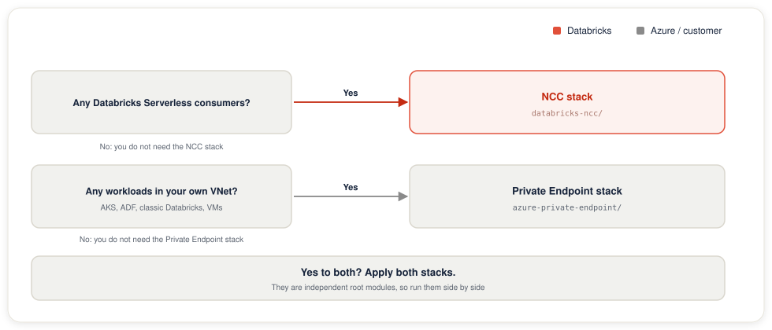

# Terraform stacks

Two independent Terraform stacks, the **NCC stack** and the **Private Endpoint stack**, picked by **which compute is reaching Aura**:

| Stack | Use when your consumer is | What it creates |
|---|---|---|
| **NCC stack**: [`databricks-ncc/`](databricks-ncc/) | **Azure Databricks Serverless** | Databricks NCC + private endpoint rule + workspace binding. The PE itself lives in the Databricks-managed subscription; nothing is created in your subscription. |
| **Private Endpoint stack**: [`azure-private-endpoint/`](azure-private-endpoint/). Setup guide: [Private Link Terraform setup](../../docs/setup-private-link-terraform.md) | Classic Databricks (VNet-injected), AKS, ADF self-hosted IR, jump VMs, Functions on VNet integration | An `azurerm_private_endpoint` in your VNet + a `databases.neo4j.io` private DNS zone + VNet link + A record. |

The two stacks are independent root modules. You can apply only one, only the other, or both side by side if different consumer classes in the same subscription need to reach Aura over both surfaces.

## Decision flow



## Important gotcha for the NCC stack with third-party PLS

When the NCC creates the PE, the request originates from the **Databricks-managed subscription** for that region, not yours. Aura's PLS has a visibility allow-list ("Target Azure Subscription IDs" in the Aura network access configuration) and will reject PE creation from a sub that isn't on it. Symptoms:

```
ThirdPartyPrivateLinkServiceProvidedDuringPrivateEndpointCreationDoesNotExistOrIsNotVisible
```

The Databricks-managed sub appears in the error path of the failed `terraform apply` (`/subscriptions/<guid>/resourceGroups/prod-<region>-snp-...`). Take that sub ID, add it to the Aura network access configuration for the corresponding Aura region (alongside your own sub), wait ~1 minute, and re-apply.

This is **not** documented in Neo4j or Microsoft public docs; it's a known operational gotcha for NCC + third-party PLS. See [`databricks-ncc/README.md`](databricks-ncc/README.md#third-party-pls-visibility-must-read-for-aura) for the troubleshooting recipe.
